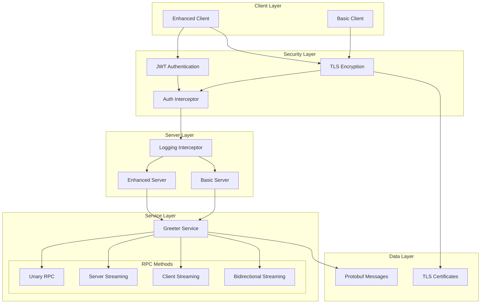
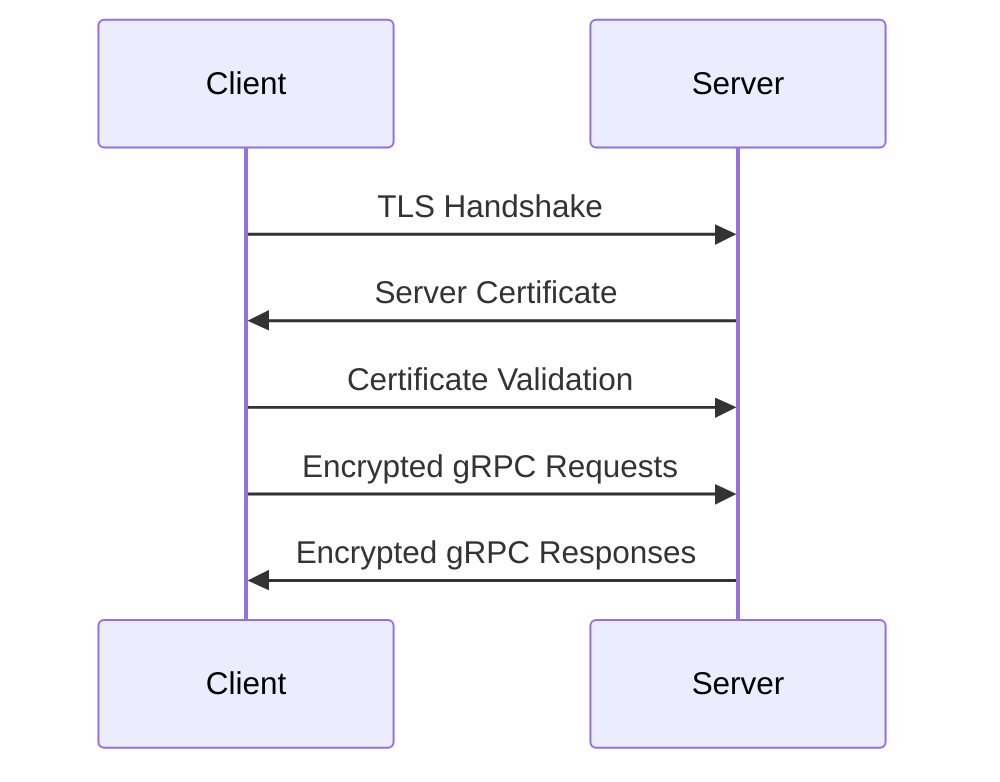
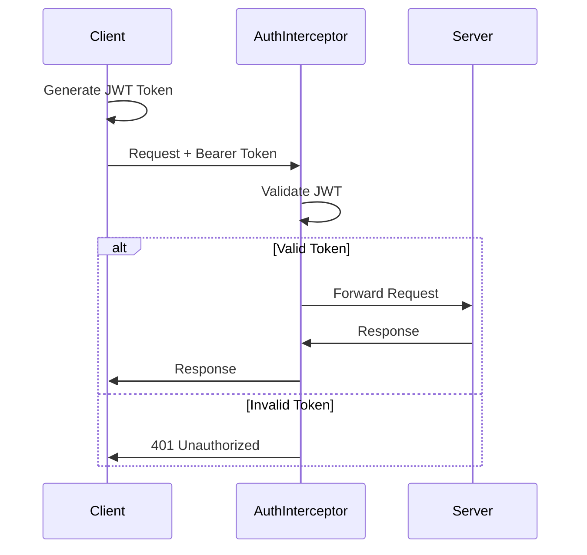
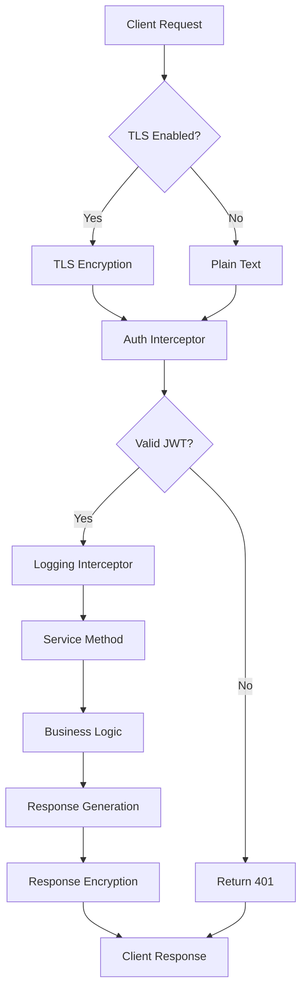

# gRPC Project Architecture

## Overview

This project implements a comprehensive gRPC-based communication system with authentication, encryption, and multiple RPC patterns. The architecture follows a client-server model with enhanced security features including JWT-based authentication and TLS encryption.

## System Architecture



## Project Structure

```
Grpc/
├── certificates/           # TLS certificates for secure communication
│   ├── server.crt         # Server certificate
│   └── server.key         # Server private key
├── docs/                  # Documentation
│   └── architecture.md    # This file
├── generated/             # Auto-generated protobuf files
│   ├── gretter_pb2.py     # Message classes
│   ├── gretter_pb2_grpc.py # Service stubs and servicers
│   └── __init__.py        # Python package marker
├── protos/                # Protocol buffer definitions
│   └── greeter.proto      # Service and message definitions
├── scripts/               # Utility scripts
│   ├── generate_proto.sh  # Protobuf generation script
│   └── setup_env.sh       # Environment setup script
├── src/
│   ├── client/            # Client implementations
│   │   ├── client.py      # Basic client
│   │   └── client_enhanced.py # Enhanced client with auth
│   └── server/            # Server implementations
│       ├── server.py      # Basic server
│       └── server_enhanced.py # Enhanced server with auth
├── requirements.txt       # Python dependencies
└── run_script.sh         # Main execution script
```

## Core Components

### 1. Protocol Buffer Definition
**File:** protos/greeter.proto

Defines the service interface and message structures:
- Service: Greeter with multiple RPC methods
- Messages: HelloRequest and HelloReply
- RPC Types: Unary, Server Streaming, Client Streaming, Bidirectional Streaming

### 2. Server Components
**Basic Server (src/server/server.py)**
- Simple gRPC server implementation
- Insecure channel (port 50051)
- Basic request handling

**Enhanced Server (src/server/server_enhanced.py)**
- Security Features:
  - TLS encryption with SSL certificates
  - JWT-based authentication
  - Request/response interceptors
- Advanced Features:
  - Comprehensive error handling
  - Logging interceptor
  - Multiple RPC pattern support
  - Graceful shutdown handling

### 3. Client Components
**Basic Client (src/client/client.py)**
- Simple gRPC client implementation
- Insecure channel connection
- Basic unary RPC calls

**Enhanced Client (src/client/client_enhanced.py)**
- Security Features:
  - TLS certificate validation
  - JWT token generation and management
  - Secure channel establishment
- Advanced Features:
  - Comprehensive RPC testing suite
  - Error handling and fallback mechanisms
  - Token expiration testing

## Security Architecture

### 1. Transport Layer Security (TLS)



**Implementation:**
- Server uses SSL certificates (server.crt, server.key)
- Client validates server certificate
- All communication encrypted in transit

### 2. Authentication & Authorization



**JWT Token Structure:**
```json
{
  "sub": "user-id",
  "iat": 1234567890,
  "exp": 1234571490,
  "iss": "your-grpc-server",
  "aud": "your-grpc-clients"
}
```

## RPC Patterns

### 1. Unary RPC
- **Method:** SayHello
- **Pattern:** Single request → Single response
- **Use Case:** Simple request-response operations

### 2. Server Streaming RPC
- **Method:** SayHelloStream
- **Pattern:** Single request → Multiple responses
- **Use Case:** Data feeds, real-time updates

### 3. Client Streaming RPC
- **Method:** SayHelloClientStream
- **Pattern:** Multiple requests → Single response
- **Use Case:** File uploads, batch processing

### 4. Bidirectional Streaming RPC
- **Method:** SayHelloBidirectional
- **Pattern:** Multiple requests ↔ Multiple responses
- **Use Case:** Chat applications, real-time collaboration

## Data Flow

### Request Processing Flow



## Error Handling Strategy

### 1. Authentication Errors
- **Code:** UNAUTHENTICATED
- **Scenarios:** Missing/invalid/expired JWT tokens
- **Response:** 401 with descriptive message

### 2. Validation Errors
- **Code:** INVALID_ARGUMENT
- **Scenarios:** Invalid request parameters
- **Response:** 400 with validation details

### 3. Internal Errors
- **Code:** INTERNAL
- **Scenarios:** Server-side exceptions
- **Response:** 500 with generic error message

### 4. Network Errors
- **Handling:** Client-side retry logic
- **Fallback:** Graceful degradation to insecure channel

## Performance Considerations

### 1. Connection Management
- **Connection Pooling:** gRPC handles connection reuse
- **Keep-Alive:** Configured for long-lived connections
- **Timeout Handling:** Appropriate timeouts for streaming operations

### 2. Threading
- **Server:** ThreadPoolExecutor with configurable worker count
- **Client:** Asynchronous operation support
- **Streaming:** Non-blocking I/O for streaming operations

### 3. Resource Management
- **Memory:** Efficient protobuf serialization
- **CPU:** Minimal overhead for authentication
- **Network:** Binary protocol reduces bandwidth usage

## Deployment Architecture

### Development Environment
- **Server:** Local development server (localhost:50051)
- **Certificates:** Self-signed certificates for testing
- **Authentication:** Hardcoded JWT secret (development only)

### Production Considerations
- **Load Balancing:** Multiple server instances behind load balancer
- **Certificate Management:** Proper CA-signed certificates
- **Secret Management:** Environment-based JWT secrets
- **Monitoring:** Comprehensive logging and metrics
- **High Availability:** Redundant server deployment

## Key Design Decisions

### 1. Security-First Approach
- **Rationale:** Modern applications require robust security
- **Implementation:** TLS + JWT authentication by default
- **Trade-off:** Slight performance overhead for security benefits

### 2. Interceptor Pattern
- **Rationale:** Cross-cutting concerns (auth, logging) separation
- **Implementation:** Modular interceptor chain
- **Benefits:** Reusable, testable, maintainable code

### 3. Multiple RPC Patterns
- **Rationale:** Demonstrate gRPC's versatility
- **Implementation:** Single service with various method types
- **Benefits:** Comprehensive testing and learning platform

### 4. Graceful Error Handling
- **Rationale:** Robust client-server communication
- **Implementation:** Comprehensive exception handling
- **Benefits:** Better user experience and debugging

### 5. Path Resolution Strategy
- **Rationale:** Cross-platform compatibility
- **Implementation:** Dynamic path calculation
- **Benefits:** Works in various development environments

## Future Enhancements

### 1. Service Mesh Integration
- **Istio/Envoy:** Advanced traffic management
- **Benefits:** Enhanced observability and security

### 2. Database Integration
- **Persistent Storage:** Add database layer
- **Benefits:** Stateful operations and data persistence

### 3. Microservices Architecture
- **Service Decomposition:** Split into multiple services
- **Benefits:** Better scalability and maintainability

### 4. Advanced Authentication
- **OAuth2/OIDC:** Industry-standard authentication
- **Benefits:** Better integration with existing systems

### 5. Monitoring and Observability
- **Metrics:** Prometheus integration
- **Tracing:** Distributed tracing support
- **Benefits:** Better operational visibility

## Testing Strategy

### 1. Unit Tests
- **Scope:** Individual service methods
- **Framework:** pytest with gRPC testing utilities

### 2. Integration Tests
- **Scope:** Client-server communication
- **Coverage:** All RPC patterns and error scenarios

### 3. Security Tests
- **Scope:** Authentication and authorization
- **Coverage:** Token validation, TLS verification

### 4. Performance Tests
- **Scope:** Load and stress testing
- **Tools:** gRPC load testing tools

## Conclusion

This architecture provides a solid foundation for gRPC-based applications with enterprise-grade security features. The modular design allows for easy extension and maintenance while demonstrating best practices for gRPC development.